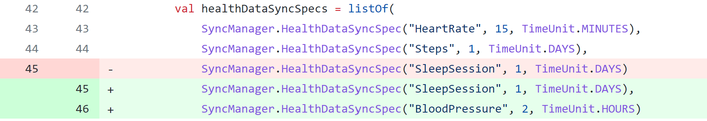
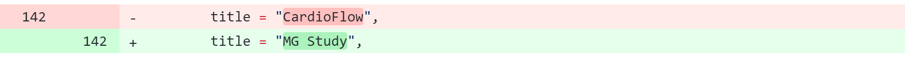
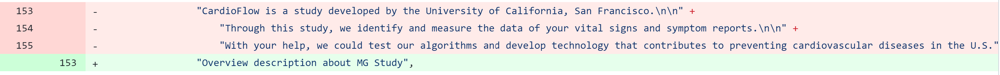
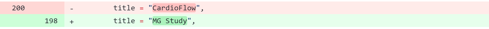
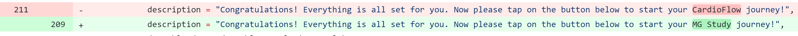
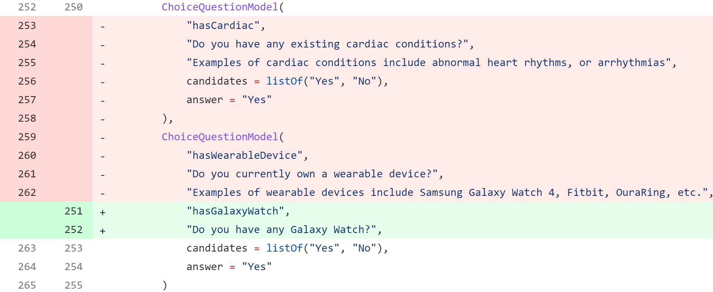

This getting started tutorial describes the steps you need to be up and running with your own study. The best way to explain the steps is to walk through a simple example, which was presented at the Samsung Developer Conference (SDC2022). Follow these steps to get started with Samsung Health Stack.

## Set up your environment

The stack consists of three pieces, which you install separately:

1. [Install the backend services and data engine.](../installation/installing-the-backend.md)
2. [Install the app software development kit (SDK).](..\installation\installing-the-sdk.md)
3. [Install the web portal.](..\installation\installing-the-portal.md)

## Set up a study

In this fictitious scenario, we've noticed that people with supernatural physical abilities have begun to appear all over the world. We call this phenomenon *Syndrome X*. We hypothesize that Syndrome X is related to specific vital signs and symptoms, such as heartrate, blood pressure, and headaches. So, we design a study to gather participants who have experienced extraordinary powers, ask them survey questions, and collect their vital signs and any symptoms. We've decided to call it the Mutant Gene (MG) study. We will collect vital signs using the Galaxy Watch 4 and symptoms using a participant survey.

Studies are managed from the Samsung Health Stack web portal. Follow these steps to set up managing the MG study:

1. [Create a new study](../study management/creating-a-study.md) in the web portal.

    > Because this is the first time logging in to the portal, the **Create a study** page automatically appears. Enter these parameters:
    >
    > - Study Name: MG Study
    > - Study Logo: whichever color you prefer 
2. [Invite team members and assign their roles](..\study management\inviting-team-members.md) to help conduct the study.

    > Creating the initial study automatically prompts you to invite team members. Let's invite Dr. McCoy as a principal investigator. Enter these parameters:
    >
    > - Email: drmccoy@yoursite.com
    > - Role: Principal Investigator
3. [Create a participant survey](../study management/creating-a-survey.md).

    > From the **Study Management** page, click **Create survey** and enter these parameters:
    > - Title: Daily Symptom Report
    > - Question 1: How intense were your headaches yesterday?
    >   - Type: Slider scale
    >   - Scale: 0 (None) to 10 (Almost dying)
    > - Question 2: Which symptom(s) appeared yesterday?
    >   - Type: Multi-selection
    >   - Options: None, Mind reading, Laser from eyes, Shadow cloaking
5. [Schedule and publish the survey.](../study management/publishing-a-survey.md)
    > From the **Create survey** page, click **Publish** and enter these parameters:
    > - Frequency: Daily
    > - Survey occurrence: Relevant publish time and duration. 

## Build the mobile app

For our study, participants wear the Samsung Galaxy Watch 4 and use an Android mobile app to collect the data. Follow these steps to use the Samsung Health Stack app SDK to create and customize the app:

1. If you are not already familiar with developing code in Android Studio, take a look at https://developer.android.com/studio/intro.

2. In Android Studio, clone the https://github.com/S-HealthStack/starter-app GitHub repository to retrieve the app starter code.

   > git clone https://github.com/S-HealthStack/starter-app.git

3. Edit the code in the `main` branch to customize it for our study.

   > In starter-app/app/src/main/java/com/samsung/healthstack/starter_app/MainActivity.kt:
   >
   > - In `override fun onCreate`, add a`SyncManager.HealthDataSyncSpec("BloodPressure", 2, TimeUnit.HOURS)`line to capture blood pressure data:
   >
   >   
   >
   > In starter-app/app/src/main/java/com/samsung/healthstack/starter_app/OnboardingModule.kt:
   >
   > - In `private fun intro`, change `title = "CardioFlow",` to `title = "MG Study",`:
   >
   >    
   > - In `private fun intro`, change the CardioFlow overview description to `"Overview description about MG Study",`:
   >
   >    
   > - In `private fun signUp`,  change `title = "CardioFlow",` to `title = "MG Study",`:
   >
   >    
   > - In `private fun signUp`,  change `CardioFlow` in `description` to `"MG Study"`:
   >
   >    
   > - In `private val eligibilityQuestions`, replace the third and fourth questions with a single Galaxy Watch question:
   >  
   >    

4. Register your app with Firebase and update the starter-app/app/google-service.json configuration file. Refer to https://firebase.google.com/docs/android/setup for details.

5. Test your app in Android Studio.

   > Due to the lack of mature libraries for wearables, testing with the Android Studio emulator is quite limited. At this point in time, most of the testing needs to happen in the live app.

6. Connect your app and the portal study.

   > In ???.xml, associate the API endpoint of the backend system and the app's portal ID.

7. Make the app available for downloading.

8. Download the app and test.

## Onboard the participants

The first step of onboarding is to onboard yourself to live test the app. Follow these participant onboarding steps:

1. Download the app to your phone.
2. Open the app and step through the prompts that you set up while building the app to determine eligibility, request consent, and register those who are eligible.
   *Note: we'll expand this section to match demo better when time permits...*
3. If not already previously done, install the [Health Platform](https://play.google.com/store/apps/details?id=com.samsung.android.service.health&hl=en&gl=US) service app on your phone.
4. If not already previously done, pair your phone and the Samsung Galaxy Watch 4.

Once you've tested the app to your satisfaction, invite prospective participants to complete the participant onboarding steps and join the study.

## Run the study to collect the data

In a real-world situation, the study would run until the scheduled end date you specified during survey. For this tutorial, have each participant (including yourself):

- Wear the watch to generate some data.
- Open the app and complete the daily survey.

- Use the app to see the data visualizations available to participants.

## Analyze the results

Now, return to the web portal to analyze the results. Results are available for each participant separately and for the study as a whole. You can:

- View various graphs.

- [Run queries](../results analysis/running-a-query.md).
   
   > From the **Data Insights** page, in the **DATA QUERY** section, enter these parameters to list people who have experienced any symptoms of Syndrome X:
   > - Table: ???
   > - Query: ???
   >
   > Next, enter these parameters to compare the vital signs of those people and others:
   > - Table: ???
   > - Query: ???
   >
   > Due to the limited data sample size, you'll likely see no meaningful difference between two groups.
   
- [Export the data for external analysis](../results analysis/exporting-data.md)).
   
   > In the **Query Results** table, click **Export .csv**.
