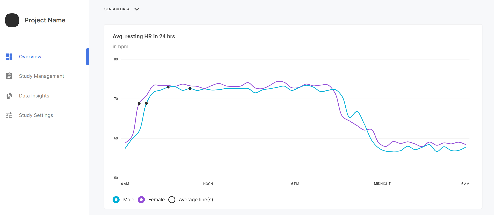

The web portal provides graphs for easy visualization of the data collected through your study. Each graph provides toggles to view the general trends of the data collected, or to filter data points by demographic.

To view graphs:

1. From the **Overview** page, scroll to the **Sensor Data** selection.
    
2. In the default state, data trend depiction is turned off. Click on the respective toggle(s) to view data trends.
    
3. To filter data by participant gender, click on the male/female toggles to adjust which datasets are displayed.
4. Hover over datapoints of interest to view additional information. By clicking on a specific datapoint, you can additionally view the records of the participant associated with that result. For more information on individual records, refer to [Viewing Individual Results](./viewing-individual-results.md).
