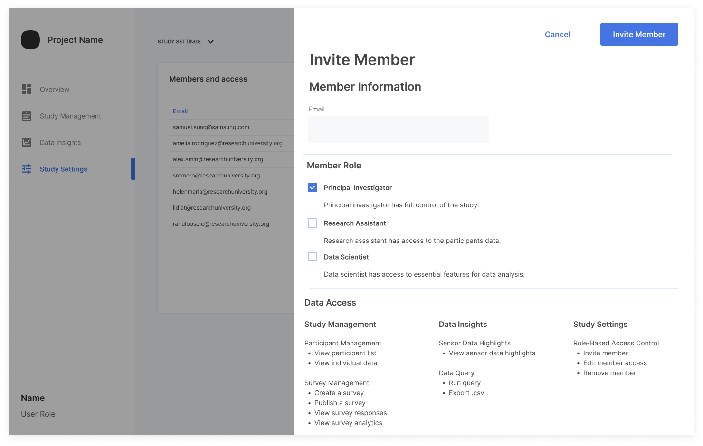

Invite as many team members to help conduct your study as you desire.

> Only members with the `Team Admin` team-level role have permission to invite members.

To add a member to the team and assign the member a role:

1. From the **Study Settings** page, in the **Members and access** section, click **Invite member**.
    

2. Enter the email address of the person to invite to the team.

3. Select a study-level role for the team member. The role-based access control feature provides security with differing levels of access permission granted to different roles:

    - Principal Investigator - has full control of the study.
    - Research Assistant - has access to the participant data.
    - Data Scientist - has access to essential features of the data analysis.

    > `Principal Investigator` is the only study-level role available in the current version (v0.9) of the portal.

4. Click **Invite Member** to add the person to the team.

5. Notify the person that you have added them as a team member for the study in the best way for your use case.

> If the person does not already have an account, they receive an account activation email containing instructions to create their account.

When completed, the system adds the `Team Member` team-level role and the selected study-level role for the spec to the person's account settings.