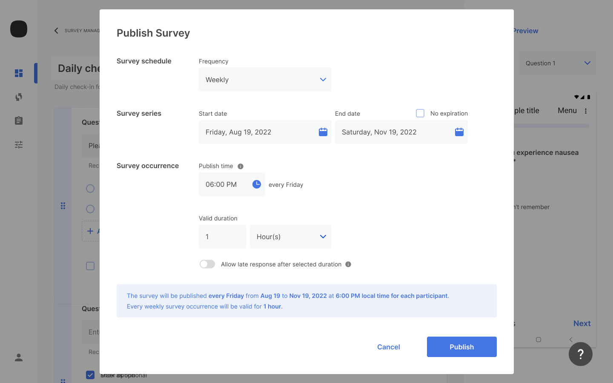

Once you've completed creating your survey questions, the next step is to schedule and publish the survey. You schedule and publish surveys through the Samsung Health Stack web portal.

To schedule and publish a survey:

1. From the **Create survey** page, click **Publish**.
    
2. Select the **Frequency** that participants will repeat your study. The options are:

    - One-time - Participants complete this survey type only once.
    - Daily - Participants complete this survey type each day of the study.
    - Weekly - Participants complete this survey type once a week for the duration of the study.
    - Monthly - Participants complete this survey type once a month for the duration of the study.
    > For months with fewer days than the date selected, the survey occurs on the last day of the month
4. For **Publish Time**, select the date and time to start showing the survey in the app.
 > **Publish Time** is local time for each participant and must be in the future for all participants.
4. For **Valid Duration**, specify the length of time that the survey will remain available to participants.
5. Optionally, select **Allow participants to take expired surveys.** to allow participants to start a survey after the survey expiration date.
6. Optionally, select **Allow late response to the survey.** to allow participants to complete an in-progress survey after the survey expiration date.
7. Click **Publish**.

> Once published, surveys cannot be modified in Healthcare Research Hub v0.9.
